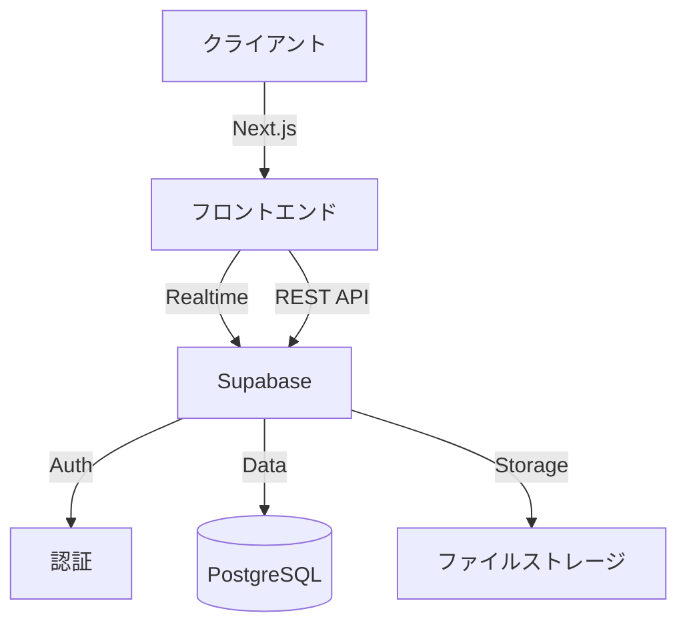

# 💬 RealChat

RealChatは、リアルタイムコミュニケーションを実現するモダンなチャットアプリケーションです。Supabaseを活用した認証システムと、直感的なユーザーインターフェースを提供します。

公開URL：https://next-chat-app-rouge.vercel.app

## 🌟 開発の背景

ビジネスやプライベートでのコミュニケーションツールとして、以下の課題を解決することを目指しました。

- セキュリティを確保しながら、簡単にグループチャットを作成したい
- シンプルで使いやすいUIでありながら、最低限の機能は備えていてほしい
- リアルタイムな更新で、スムーズなコミュニケーションを実現したい

## 🔥 特徴と機能

### 1. 📱 シンプルで直感的なUI

- モダンなデザインとレスポンシブ対応
- メッセージの送信状態をリアルタイムで表示
- メッセージの暗号化保存機能
- チャットルームごとにメッセージ数の制限（30メッセージを超えると自動的に削除）

### 2. 👤 マイページ機能

- アカウント設定
  - プロフィール画像のアップロード (5MB以下のJPG, PNG, GIF, WebP形式)
  - ユーザー名の設定・変更
  - メールアドレスの変更（確認メール送信）
  - パスワードの変更
  - アカウントの削除
- 詳細な使い方ガイド
  - トークルームの作成・参加方法
  - メンバーの招待方法
  - 各種設定の変更手順

### 3. 🔐 認証・招待システム

- Supabaseによる安全な認証基盤
- 招待リンクによる簡単なルーム参加
- ユーザーごとの参加ルーム数制限（最大5ルーム）

### 4. 👥 グループ管理機能

- チャットルームの作成・編集・削除
- メンバー管理（招待・退出）
- ルームアイコンのカスタマイズ
- メンバー一覧の表示

## 🛠️ 使用技術

### フロントエンド

- ⚛️ Next.js 15
- 📘 TypeScript
- 🎨 Tailwind CSS
- 🎯 Shadcn/ui
- 📝 React Hook Form
- 🔄 Supabase Realtime

### バックエンド

- 🔥 Supabase
  - 🔑 Authentication
  - 🗄️ PostgreSQL
  - 📦 Storage
  - 🔄 Realtime Subscriptions

### インフラ・開発環境

- ☁️ Vercel (ホスティング)
- 🔧 Git/GitHub
- 💻 VSCode
- 🧹 ESLint/Prettier

### システム構成図

## 👨‍💻 開発情報

- 👤 開発体制：個人開発
- ⏰ 開発期間：2024年12月〜2025年2月 (約150時間)

## 💡 工夫した点

### 1. パフォーマンス最適化

- メッセージの自動削除機能（30メッセージ制限）
- 画像の最適化（アップロード前の検証）
- リアルタイム更新の効率化

### 2. セキュリティ対策

- メッセージの暗号化保存
- ファイルアップロードの制限と検証
- 適切なアクセス制御

### 3. ユーザビリティ

- スクロール位置の保持
- トースト通知による分かりやすいフィードバック
- 詳細な使い方ガイドの提供

## 🔜 今後の展望

### 機能拡張

- 📎 ファイル添付機能
- 📨 新着メッセージ確認
- 🔍 メッセージ検索機能
- 👥 グループ管理機能の拡充
- 🌐 多言語対応

### 改善計画

- パフォーマンスの更なる最適化
- モバイルアプリ版の開発
- E2Eテストの追加

## 📞 連絡先

作者に連絡する場合は以下までお願いします：

- 📧 Email: ri22077b@st.omu.ac.jp
- 🌐 Portfolio: https://s-ao213.github.io/portfolio
- 💼 GitHub: https://github.com/s-ao213
